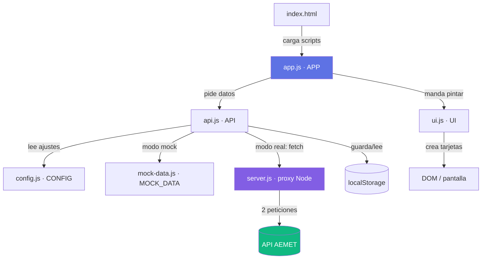
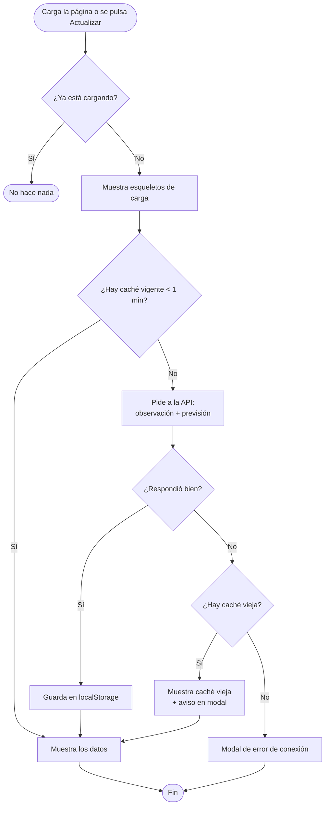
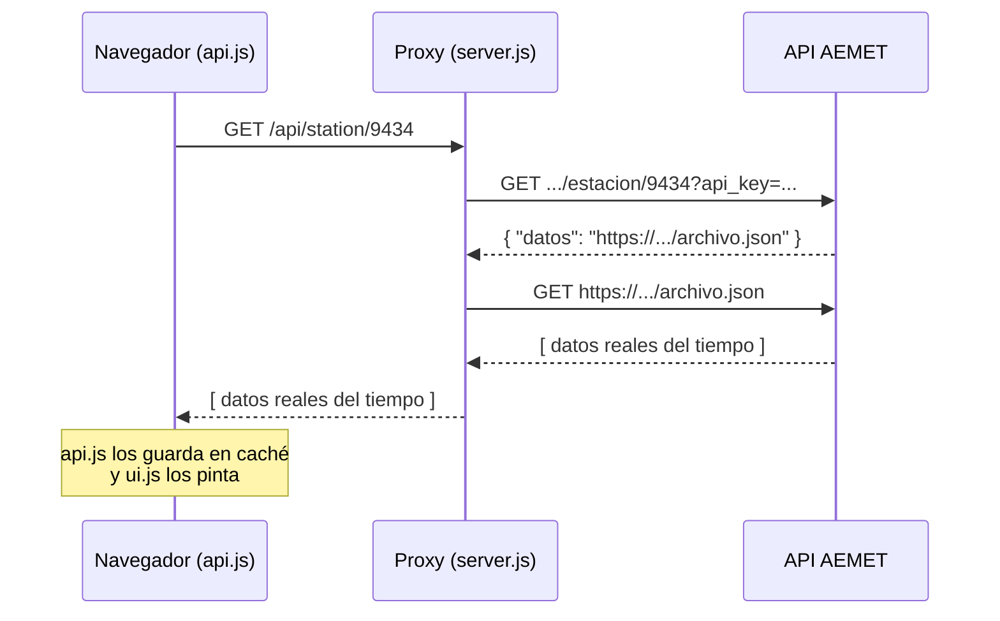

# Documentación — Meteorología Zaragoza (11-aemet)

Guía detallada para **entender el proyecto a fondo**: qué hace, cómo está organizado y cómo
funciona por dentro. El [README.md](README.md) tiene la versión corta; este documento es la
explicación didáctica paso a paso.

---

## Índice

1. [Visión general](#1-visión-general)
2. [Cómo ejecutarla](#2-cómo-ejecutarla)
3. [Los dos modos: mock vs. real](#3-los-dos-modos-mock-vs-real)
4. [Estructura de archivos](#4-estructura-de-archivos)
5. [Flujo completo paso a paso](#5-flujo-completo-paso-a-paso)
6. [Diagramas (Mermaid)](#6-diagramas-mermaid)
7. [Cada archivo JS en detalle](#7-cada-archivo-js-en-detalle)
8. [La API de AEMET (el patrón de dos pasos)](#8-la-api-de-aemet-el-patrón-de-dos-pasos)
9. [Sistema de caché](#9-sistema-de-caché)
10. [Documentación del CSS (styles.css)](#10-documentación-del-css-stylescss)
11. [Detalles importantes del código](#11-detalles-importantes-del-código)
12. [Problemas frecuentes](#12-problemas-frecuentes)

---

## 1. Visión general

Aplicación web que muestra el tiempo de **Zaragoza** usando los datos abiertos de **AEMET**
(Agencia Estatal de Meteorología). Está hecha con **HTML + CSS + JavaScript puro** (sin React,
sin librerías de frontend) e incluye un pequeño **servidor proxy** en Node.js.

La página tiene tres bloques:

- **Condiciones Actuales** — temperatura, humedad, presión, viento, racha actual (la de la última lectura tomada) y precipitación de la última observación.
- **Datos últimas 24h** — máxima y mínima de temperatura del día y racha de viento máxima, con la hora.
- **Previsión 5 Días** — máxima/mínima, humedad, viento, racha y probabilidad de lluvia.

Hay un botón **"Actualizar datos"** y se muestra la hora de la última actualización.

---

## 2. Cómo ejecutarla

### Opción A — Datos reales (recomendada)

Requiere Node.js. Desde la carpeta `11-aemet`:

```bash
npm install      # solo la primera vez (instala express, axios, cors)
npm start        # arranca el servidor proxy en http://localhost:3000
```

Luego abre en el navegador **`http://localhost:3000`**.

> ⚠️ **Importante:** con datos reales hay que entrar por `http://localhost:3000`,
> **no** abriendo el `index.html` con doble clic. Si lo abres directo, el navegador
> bloquea las peticiones a AEMET por CORS.

Requisito: en [assets/js/config.js](assets/js/config.js) debe estar `USE_MOCK_DATA: false`.

### Opción B — Datos de ejemplo (sin instalar nada)

1. En [assets/js/config.js](assets/js/config.js) pon `USE_MOCK_DATA: true`.
2. Abre `index.html` directamente en el navegador.

Mostrará datos fijos capturados el 04/06/2026 (no cambian nunca).

---

## 3. Los dos modos: mock vs. real

Todo se controla con **una sola variable** en [assets/js/config.js](assets/js/config.js):

```js
USE_MOCK_DATA: false   // false = datos reales (proxy) | true = datos de ejemplo
```

| | `USE_MOCK_DATA: true` | `USE_MOCK_DATA: false` |
|---|---|---|
| Origen de datos | Archivo `mock-data.js` | API real de AEMET vía proxy |
| ¿Necesita servidor? | No | Sí (`node server.js`) |
| Cómo abrir | `index.html` directo | `http://localhost:3000` |
| ¿Los datos cambian? | No (fijos) | Sí (en vivo) |

El archivo `api.js` es el que mira esa variable: si es `true` devuelve los datos de
`mock-data.js`; si es `false` hace `fetch` al proxy. **El resto del código no nota la
diferencia**, porque el mock tiene exactamente la misma forma que la respuesta real.

---

## 4. Estructura de archivos

```
11-aemet/
├── index.html              # Estructura de la página (HTML)
├── server.js               # Servidor proxy Node.js (evita CORS con AEMET)
├── package.json            # Dependencias (express, axios, cors)
├── README.md               # Documentación corta
├── DOCUMENTACION.md        # Este documento
│
└── assets/
    ├── css/
    │   └── styles.css      # Estilos (tema oscuro, responsive)
    └── js/
        ├── config.js       # Configuración: API key, IDs, modo mock/real
        ├── mock-data.js    # Datos de ejemplo (misma forma que la API real)
        ├── api.js          # Capa de datos: fetch al proxy + caché en localStorage
        ├── ui.js           # Renderiza los datos en el DOM (crea las tarjetas)
        └── app.js          # Orquestador: arranca la app y coordina API + UI
```

Los 5 scripts se cargan al final del `index.html` **en este orden** (importa, porque cada uno
usa al anterior):

```html
<script src="assets/js/config.js"></script>   <!-- 1. ajustes globales (CONFIG) -->
<script src="assets/js/mock-data.js"></script> <!-- 2. datos de ejemplo (MOCK_DATA) -->
<script src="assets/js/api.js"></script>       <!-- 3. capa de datos (API) -->
<script src="assets/js/ui.js"></script>        <!-- 4. renderizado (UI) -->
<script src="assets/js/app.js"></script>       <!-- 5. orquestador (APP) -->
```

Cada archivo define un objeto global (`CONFIG`, `MOCK_DATA`, `API`, `UI`, `APP`) que actúa
como un "módulo". Es un patrón sencillo para separar responsabilidades sin usar `import`/`export`.

---

## 5. Flujo completo paso a paso

Qué ocurre desde que se abre la página hasta que se ven los datos:

```
1. Se carga index.html y, al final, sus 5 scripts en orden.

2. app.js detecta que el DOM está listo  →  APP.init()
       │
       ├─ setupEventListeners()   conecta el botón "Actualizar" y el cierre del modal
       └─ loadData()              arranca la carga de datos

3. loadData():
       ├─ Muestra esqueletos de carga (skeletons)
       │
       ├─ ¿Hay caché vigente (< 1 min)?  ── sí ──►  la muestra y termina
       │
       ├─ no → pide a la API:
       │        ├─ API.getWeatherData()    → observación actual de la estación
       │        └─ API.getForecastData()   → previsión de 5 días
       │
       ├─ guarda el resultado en localStorage (caché)
       │
       └─ displayData()  → se lo pasa a la UI

4. ui.js renderiza en pantalla:
       ├─ renderCurrentWeather()  pinta temperatura, humedad, presión, viento, racha actual, lluvia
       ├─ updateExtremes()        calcula máx/mín del día y racha máxima
       └─ renderForecast()        pinta las 5 tarjetas de previsión
```

**Si algo falla** (AEMET no responde, error de red…), `app.js` intenta mostrar la
**última caché aunque haya caducado** y avisa con un modal. Solo si no hay nada guardado
muestra un error de conexión. Esto se llama *graceful degradation* (degradación elegante):
la app sigue siendo útil aunque la fuente externa falle.

---

## 6. Diagramas (Mermaid)

> Estos diagramas se renderizan automáticamente en GitHub, VS Code (con extensión Mermaid) y
> muchos editores Markdown. Si los ves como texto plano, es que tu visor no soporta Mermaid.

### 6.1. Arquitectura: quién usa a quién

Cómo se relacionan los módulos. Las flechas indican "depende de / llama a".



### 6.2. Flujo de carga de datos (decisión caché → API → fallback)



### 6.3. La petición a AEMET (patrón de dos pasos)

Por qué hace falta el proxy: AEMET responde con una URL, no con los datos.



---

## 7. Cada archivo JS en detalle

### config.js — La configuración
Todos los ajustes en un solo sitio: API key de AEMET, ID de estación (`9434`), código de
municipio (`50297`), duración de caché y el interruptor `USE_MOCK_DATA`. Si quieres cambiar
de ciudad o de modo, **es el único archivo que tocas**.

### mock-data.js — Datos de ejemplo
Un objeto `MOCK_DATA` con `current` (observaciones horarias) y `forecast` (5 días). Lo clave:
tiene **exactamente la misma estructura** que la respuesta real de AEMET. Así el modo mock y
el modo real son intercambiables sin cambiar nada más.

### api.js — La capa de datos
Responsable de **conseguir los datos** y **gestionar la caché**:
- `getWeatherData()` / `getForecastData()` — devuelven el mock o hacen `fetch` al proxy, según `USE_MOCK_DATA`.
- `saveToCache()` / `getFromCache()` — guardan/leen de `localStorage` con marca de tiempo.
- `getStaleCache()` — devuelve la caché aunque haya expirado (red de seguridad ante errores).
- `clearCache()` — la borra (la usa el botón "Actualizar" para forzar datos frescos).

### ui.js — El renderizado
Solo se encarga de **pintar** en pantalla. No sabe nada de redes ni de caché. Lo más relevante:
- `renderCurrentWeather()` — crea las tarjetas de clima actual (incluida la **racha actual**: el `vmax` de la última lectura, en km/h).
- `updateExtremes()` — recorre las observaciones del día y calcula máx/mín de temperatura y racha máxima, con su hora.
- `normalizeDecimal()` — convierte un valor a número aceptando coma decimal (formato AEMET); la usan `renderCurrentWeather()` y `updateExtremes()`.
- `renderForecast()` — crea las 5 tarjetas de previsión.
- `createWeatherItem()` / `createForecastItem()` — construyen cada tarjeta con `document.createElement` (nada de `innerHTML`).
- `formatValue()` — formatea números a 1 decimal y maneja valores vacíos (muestra `--`).
- `showAlert()` / `closeAlert()` — modal de avisos (en vez del `alert()` del navegador).
- `renderSkeletons()` — los rectángulos grises que se ven mientras cargan los datos.

### app.js — El orquestador
El **director de orquesta**. Cuando carga la página, pide los datos a `api.js` y se los pasa a
`ui.js`. Gestiona el flujo: caché → API → fallback. También conecta los botones. Tiene un flag
`isLoading` para evitar cargas simultáneas si pulsas "Actualizar" varias veces seguidas.

---

## 8. La API de AEMET (el patrón de dos pasos)

AEMET funciona de una forma poco habitual que conviene entender:

1. Haces una petición a la API con tu `api_key`.
2. AEMET **no** te devuelve los datos directamente, sino un JSON con un campo `datos` que
   contiene **otra URL**.
3. Tienes que hacer una **segunda petición** a esa URL para obtener el JSON real.

Esto, sumado a que el navegador no puede llamar a AEMET directamente (CORS), es **la razón de
existir de `server.js`**. El proxy hace los dos pasos por ti y te devuelve ya el JSON final.

### Endpoints del proxy

| Ruta del proxy | Qué devuelve | Endpoint real de AEMET |
|---|---|---|
| `GET /api/station/:id` | Observación de la estación | `/observacion/convencional/datos/estacion/{id}` |
| `GET /api/forecast/:code` | Previsión diaria del municipio | `/prediccion/especifica/municipio/diaria/{code}` |

- **Estación `9434`** = Zaragoza Aeropuerto.
- **Municipio `50297`** = Zaragoza (código INE).

> 🔑 La API key está en `config.js` y en `server.js`. Es gratuita y se obtiene en
> [opendata.aemet.es](https://opendata.aemet.es/centrodedescargas/altaUsuario). Caduca con el
> tiempo, así que algún día habrá que renovarla.

---

## 9. Sistema de caché

Para no saturar a AEMET (que limita las peticiones), la app guarda los datos en el
`localStorage` del navegador durante **1 minuto** (`CACHE_DURATION` en `config.js`):

- Recargas dentro de ese minuto → usa la caché, no llama a AEMET.
- Pasado el minuto → vuelve a pedir datos frescos.
- El botón **"Actualizar datos"** **ignora** la caché y fuerza datos nuevos.
- Si AEMET falla, se usa la caché vieja (aunque haya caducado) como red de seguridad.

---

## 10. Documentación del CSS (styles.css)

El archivo [assets/css/styles.css](assets/css/styles.css) define un **tema oscuro** moderno,
responsive y con animaciones. Está organizado por bloques.

### 10.1. Variables CSS (`:root`)

Todos los colores y valores reutilizables se declaran una sola vez al principio, como
*variables CSS*. Así, para cambiar el aspecto de toda la app basta con tocar aquí.

```css
:root {
    --font-base: 10px;          /* base para usar rem fácilmente (1rem = 10px) */
    --color-primary: #5e72e4;   /* azul principal (botones, acentos) */
    --color-secondary: #825ee4; /* morado (degradados, bordes) */
    --bg-dark: #0f172a;         /* fondo de la página */
    --card-dark: #1e293b;       /* fondo del contenedor */
    --card-darker: #0f1729;     /* fondo de las tarjetas */
    --text-light: #e2e8f0;      /* texto principal */
    --text-muted: #94a3b8;      /* texto secundario (etiquetas) */
    /* ...sombras, transiciones, etc. */
}
```

> 💡 **Truco del `font-base: 10px`.** Al poner el tamaño base en `10px`, cada `1rem` equivale a
> `10px`, así que `2.4rem` = 24px. Hace las medidas muy fáciles de calcular de cabeza.

### 10.2. Reset y base

```css
* { margin: 0; padding: 0; box-sizing: border-box; }
```

Quita los márgenes por defecto del navegador y hace que `width`/`height` incluyan el `padding`
y el borde (`border-box`), que es lo más cómodo para maquetar.

### 10.3. Layout principal

- **`.container`** — caja central con ancho máximo (`120rem` = 1200px), centrada con `margin: auto`,
  esquinas redondeadas y sombra. Es la "tarjeta grande" que contiene todo.
- **`.weather-grid`, `.forecast-grid`, `.extremes`** — usan **CSS Grid** con
  `repeat(auto-fit, minmax(...))`. Esto crea columnas que **se ajustan solas** al ancho
  disponible: en pantalla grande caben varias, en móvil se apilan. Es la clave del diseño responsive.

### 10.4. Las tarjetas

- **`.weather-item`** (clima actual) y **`.forecast-item`** (previsión) — fondo oscuro, bordes
  redondeados y un efecto `:hover` que las **eleva** ligeramente (`transform: translateY(-0.5rem)`)
  y aumenta la sombra. Da sensación de profundidad e interactividad.
- Las de previsión tienen un borde superior de color (`border-top`) como detalle visual.

### 10.5. Animaciones (`@keyframes`)

| Animación | Dónde se usa | Qué hace |
|---|---|---|
| `skeleton-loading` | `.skeleton` | Mueve un degradado de izquierda a derecha (efecto "cargando"). |
| `spin` | `.btn-refresh.loading::after` | Gira el circulito del botón mientras carga. |
| `fadeIn` | `.modal` | El fondo oscuro del modal aparece con un fundido. |
| `slideUp` | `.modal-content` | La ventana del modal sube y aparece suavemente. |

Los **esqueletos** (`.skeleton`) son esos rectángulos grises animados que se ven antes de que
lleguen los datos: mejoran la sensación de velocidad.

### 10.6. El botón "Actualizar"

`.btn-refresh` usa un **degradado** azul→morado (`linear-gradient`). Cuando está cargando, se le
añade la clase `loading` (desde `ui.js`), que lo desactiva (`pointer-events: none`) y le pinta un
**spinner** girando con el pseudo-elemento `::after`.

### 10.7. El modal de avisos

`.modal` está oculto por defecto (`display: none`) y se muestra al añadirle la clase `active`
(`display: flex`), que también lo centra en pantalla. La propiedad `white-space: pre-line` en el
mensaje permite que los saltos de línea (`\n`) del texto de error se respeten.

### 10.8. Responsive (`@media`)

Hay dos puntos de ruptura:

- **`max-width: 768px`** (tablets/móviles): reduce tamaños de fuente, hace que los extremos y la
  previsión pasen a **una sola columna**, y el botón ocupa el ancho completo.
- **`max-width: 480px`** (móviles pequeños): reduce todavía más los tamaños de fuente y el padding.

### 10.9. Detalles finales

- **Scrollbar personalizada** (`::-webkit-scrollbar`) — barra de desplazamiento fina y oscura,
  a juego con el tema (solo en navegadores basados en Chrome/Edge/Safari).
- La regla final fuerza `color: inherit` en los elementos de texto para garantizar que **todo
  el texto sea legible** sobre los fondos oscuros.

---

## 11. Detalles importantes del código

- **Conversión de unidades.** La *observación* de AEMET da el viento en **m/s**, así que `ui.js`
  lo multiplica por `3.6` para mostrarlo en **km/h**. La *previsión*, en cambio, ya viene en km/h.
  (Por eso una se convierte y la otra no.)

- **El dato "actual"** es el **último** elemento del array de observaciones: vienen ordenadas
  cronológicamente y el más reciente es el último.

- **Racha actual vs. racha máxima.** Son dos cosas distintas:
  - *Racha actual* (en **Condiciones Actuales**) es el `vmax` de la **última lectura tomada**,
    el dato más reciente de la estación (m/s → km/h con `× 3.6`).
  - *Racha máxima* (en **Datos últimas 24h**) es el **mayor** `vmax` de todas las observaciones
    del día, con la hora a la que se registró (lo calcula `updateExtremes()`).

- **Racha máxima de la previsión.** El periodo diario `00-24` de AEMET suele venir vacío, así que
  la función `maxRacha()` toma el mayor valor de los subperiodos (`00-12`, `12-24`).

- **Sin `innerHTML` ni `onclick`.** Toda la interfaz se construye con `document.createElement`
  y los eventos se enlazan con `addEventListener`. Es más seguro (evita inyección de HTML) y es
  buena práctica.

- **Modal propio en vez de `alert()`.** Los avisos usan un modal de la propia página, que queda
  integrado con el diseño y no bloquea el navegador.

---

## 12. Problemas frecuentes

**No veo datos actuales, siempre son los mismos.**
Estás en modo mock. Pon `USE_MOCK_DATA: false` en `config.js`, arranca `npm start` y entra por
`http://localhost:3000`.

**Error 429 (Too Many Requests).**
AEMET limita las peticiones de la capa gratuita. Espera unos segundos y pulsa "Actualizar". La
caché de 1 minuto ayuda a no provocarlo.

**La página carga pero no aparecen datos / error de conexión.**
Comprueba que:
- El servidor está arrancado (`npm start`).
- Entras por `http://localhost:3000` y no abriendo el `index.html` directamente.
- La API key de `config.js` / `server.js` sigue siendo válida.

**¿Puedo cambiar de ciudad?**
Sí. Cambia `STATION_ID` (estación de observación) y `MUNICIPIO_ID` (código INE para la previsión)
en `config.js`. Los listados están en la web de AEMET OpenData.

---

*Proyecto educativo. Datos meteorológicos © AEMET.*
